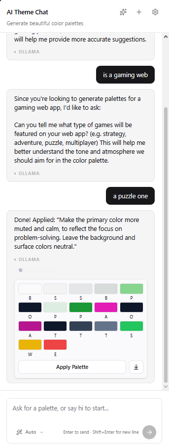
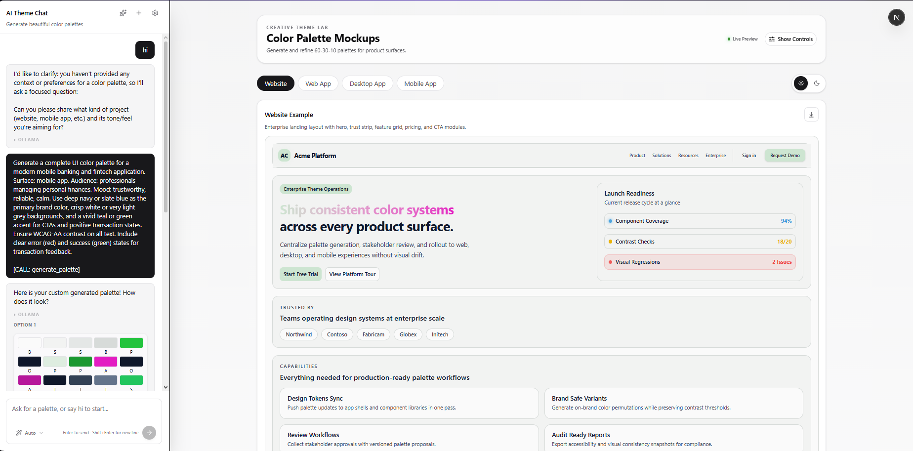
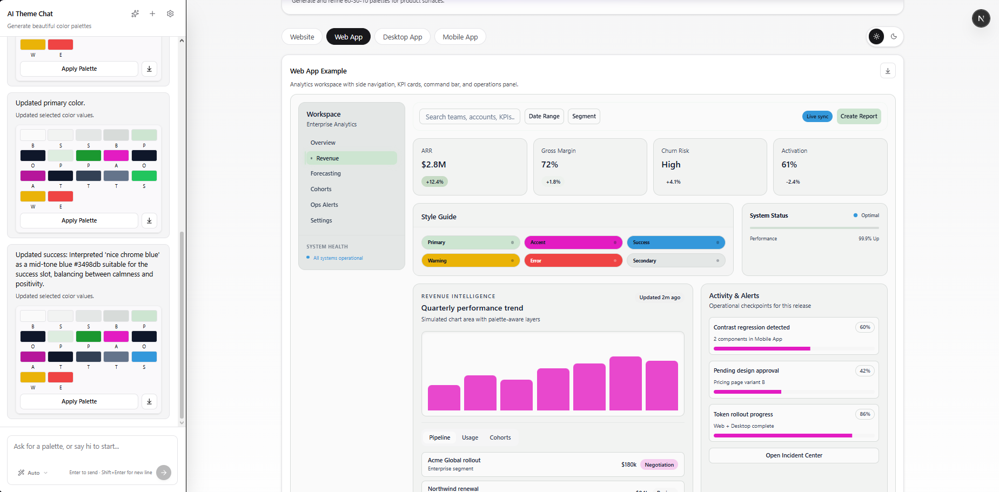
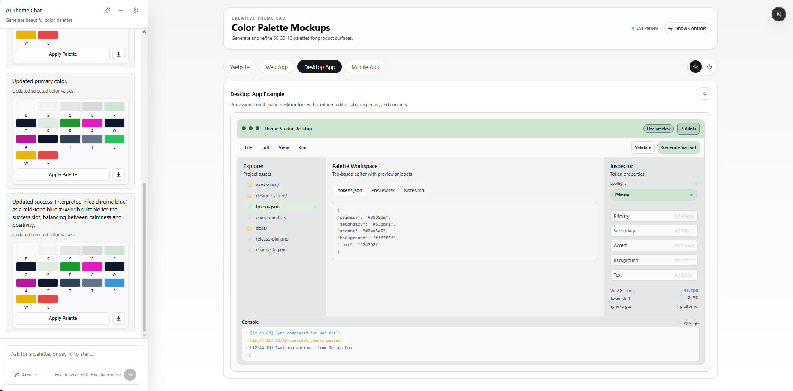
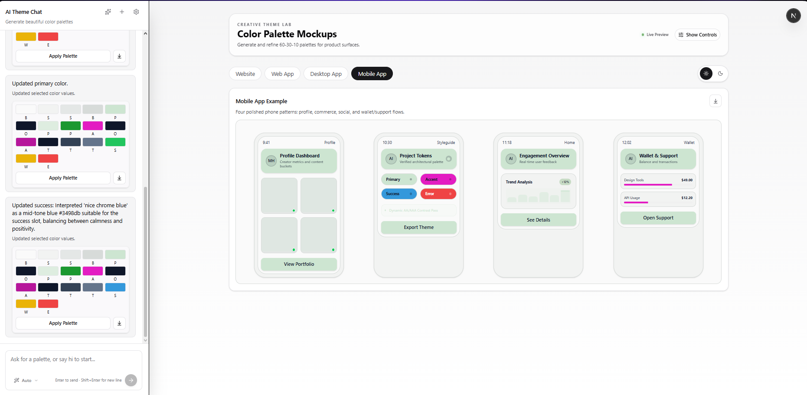
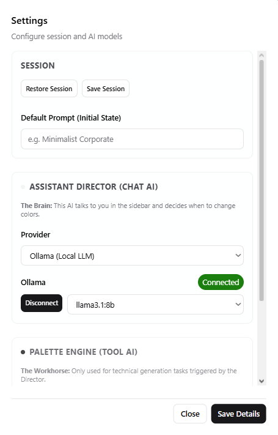

# Theme AI Generator

Creative Theme AI Generator is a multi-surface design assistant that helps users generate and refine UI color palettes using chat, then preview the result across realistic Website, Web App, Desktop App, and Mobile App mockups.

Flow:
`Frontend -> Copilot Orchestrator (cloud reasoning) -> MCP tools (local/server) -> LLM provider (Gemini/Ollama/OpenAI)`

---

## Agents League Submission Pack (Creative Apps)

### Track
- `Creative Apps (GitHub Copilot)`

### Developers / Team
- **[Your Name]** - [@yourgithub](https://github.com/yourgithub)
- *(Add any other team members here)*

### Project Description (submission-ready draft)
Theme AI Generator is a creative productivity application for designers and developers who need fast palette exploration with practical UI context. Users chat with an AI assistant to generate a five-color system (`primary`, `secondary`, `accent`, `background`, `text`), then immediately preview the palette on enterprise-grade mock interfaces across website, analytics web app, desktop workspace, and mobile patterns.  

The app is designed for quick experimentation and iterative refinement. Users can edit a single color manually (advanced picker + RGB/hex), regenerate all colors from mood prompts, or target one color using natural-language instructions. The backend is a local MCP-style server that routes generation to multiple providers (Ollama, OpenAI, Gemini, Copilot SDK) with deterministic fallback behavior for resilience.

The project focuses on creative speed, consistent output contracts, and practical presentation quality. Instead of abstract swatches only, it demonstrates how a palette behaves in real UI structures (navigation, cards, tables, pricing blocks, activity panels, editor panes, and mobile cards). This makes the output easier to evaluate for readability, hierarchy, and brand tone.

### Demo Materials
- **Demo Video**: [YouTube Link (Replace Me)](https://youtube.com/watch?v=REPLACE_ME)
- **Visual Gallery**: See our [Mockup & UI Gallery](./docs/screenshots/README.md)
- **Copilot Evidence**: Read the [Prompt Highlights](./docs/PROMPT_HIGHLIGHTS.md) (Curated) or the [Full Log](./docs/copilot_prompt_respopnse-RAW.md).

### 🖼️ UI & Mockup Gallery

| Web Interface | Website Preview | Web App Analytics |
| :---: | :---: | :---: |
|  |  |  |

| Desktop Workspace | Mobile Experience | Settings & Logic |
| :---: | :---: | :---: |
|  |  |  |

*(Full gallery available in [docs/screenshots](./docs/screenshots))*


### Quick Setup Summary

The repository is built as a **Monorepo** with two completely independent entry points. You can run either the web app or the native MCP Server, or both depending on your needs.

#### 1. Common Setup
```bash
bun install
cp packages/mcp-server/.env.example .env
```

#### 2. Run the Web App (Full UI)
If you want the full graphical interface for generating and previewing palettes:
```bash
bun run dev:web
```
Open `http://localhost:3000`

#### 3. Run the Standalone MCP Server
If you want to plug the color generator directly into your AI IDE (Copilot, Claude Desktop, etc.) without needing the web UI:
```bash
bun run dev:mcp
```

### Copilot Usage Evidence
We used GitHub Copilot (VS Code Agent/Edit/Ask modes) for approximately **70% of implementation**, then continued manually after weekly quota limits.

Use the template below to paste your real Copilot prompts and outputs before submission:

| Area | Copilot Prompt / Action | Result / Impact |
| --- | --- | --- |
| MCP routing | `Refactor provider routing with fallback and strict palette validation` | Reduced provider-specific branching bugs |
| UI overhaul | `Create enterprise preview components with reusable shadcn primitives` | Faster multi-file UI delivery |
| LLM Integration | `Replace aistudio direct fetch with official @google/genai SDK` | Improved reliability and token handling |
| Orchestration | `Implement dual-brain workflow with Copilot SDK as creative director` | High-quality reasoning vs precise tool execution |

### 🧠 Copilot SDK Integration
We have deeply integrated the **GitHub Copilot SDK** as the primary "Creative Director" of the system.
- **Intent Discovery**: Before generating colors, the system uses the Copilot SDK to reason about the user's project and propose three distinct stylistic directions.
- **Agentic Orchestration**: The SDK manages the high-level conversation state, while the low-level palette math is delegated to specialized MCP tools.
- **Seamless Fallback**: If the SDK is unavailable, the system transparently falls back to local Ollama or raw Gemini/OpenAI providers.

### 🔄 Multi-Step Reasoning & Self-Correction
The system doesn't just pass text to an LLM; it implements a robust reasoning loop to ensure technical quality and accessibility.

#### Example: The Accessibility Correction Loop
1.  **Creative Intent**: User asks for a "light neon palette."
2.  **LLM Generation**: The model proposes a bright yellow background with white text (low contrast).
3.  **Validation Step**: The `enforcePaletteAccessibility` logic calculates the contrast ratio between `text` and `background`.
4.  **Loop/Correction**: If the ratio is below 4.5:1 (WCAG AA), the system automatically triggers a correction, selecting the most readable text color (dark navy or white) to preserve the aesthetic while ensuring usability.
5.  **Evidence**: The user receives a notification: *"Applied readability adjustment for text contrast."*

This allows the "Creative Director" (Copilot) to focus on the mood, while the "Technical Engine" (MCP) ensures the design is actually functional.

### Technical Highlights
- Multi-provider LLM routing with deterministic fallback in [`llmService.ts`](./apps/web/src/lib/mcp-server/llmService.ts)
- Official **Gemini SDK** integration for high-performance generation
- Dual-brain orchestration: **Copilot SDK** for discovery vs **LLM Service** for execution
- Strict palette output contract and lowercase hex normalization
- Centralized HTTP error classification and status mapping in [`httpErrors.ts`](./apps/web/src/lib/mcp-server/httpErrors.ts)
- Deployment-safe web API routes under `apps/web/src/app/api/mcp/*`
- Enterprise-grade preview system with shared mockup primitives

### Challenges & Learnings
- **Challenge**: provider failures produced mixed error semantics.  
  **Learning**: map errors centrally and separate input, upstream, timeout, and server failure classes.
- **Challenge**: palette demos were visually simple and not judge-friendly.  
  **Learning**: realistic product surfaces communicate color quality better than isolated swatches.
- **Challenge**: localhost assumptions break remote demos.  
  **Learning**: default to same-origin proxy for backend access, allow override with env.

---

## Core Features

- Ephemeral chat by default (no automatic history persistence)
- Explicit `Save` and `Restore` session actions via browser storage
- Palette generation from mood/theme prompt
- Per-color editing:
  - manual advanced control (hex + rgb + color picker)
  - prompt-based single-color update
  - full palette regeneration
- Live theme application across:
  - website
  - web app
  - desktop app
  - mobile app
- Provider routing with deterministic fallback:
  - `ollama`
  - `openai`
  - `gemini` (official SDK)
  - `copilot` (via `@github/copilot-sdk`)

---

## Monorepo Architecture

This project is structured as a monorepo to safely share AI logic while maintaining independent execution environments:

- `apps/web`: Next.js UI (chat, controls, previews, web API routes). It uses the shared core for fast, serverless-friendly LLM generation without requiring a persistent separate MCP process.
- `packages/mcp-server`: The native Model Context Protocol (MCP) server. Used for integrating the palette generator natively into AI assistants like Claude Desktop or IDEs.
- `packages/core`: Shared models, LLM routing logic, prompts, and deterministic fallback functions used by both the Web App and the MCP Server.

---

## 🤖 MCP Server Setup Instructions

You can plug the native MCP server directly into your favorite AI tools.

### Claude Desktop
Add this to your `claude_desktop_config.json`:
```json
{
  "mcpServers": {
    "theme-ai-generator": {
      "command": "bun",
      "args": ["run", "/absolute/path/to/theme-ai-generator/packages/mcp-server/src/server.ts"]
    }
  }
}
```

### VS Code (with Antigravity or Roo-Code)
Add this to your MCP configuration settings in VS Code:
```json
{
  "mcpServers": {
    "theme-ai": {
      "command": "bun",
      "args": ["run", "/absolute/path/to/theme-ai-generator/packages/mcp-server/src/server.ts"]
    }
  }
}
```

### GitHub Copilot (if supporting local MCP)
If your Copilot environment supports direct local MCP processes, configure the command similarly:
```bash
bun run /path/to/repo/packages/mcp-server/src/server.ts
```

---

## API & Generation Routes

Whether running via Web API (`apps/web/...`) or via MCP Tools (`packages/mcp-server/...`), the system exposes the same capabilities:

- `generate_theme_palette` (returns palette JSON)
- `tweak_color` (returns tweaked palette JSON)
- `discover_theme_styles` (drafts 3 creative directions)

The standard output format for a palette object across the system is normalized:

```json
{
  "primary": "#rrggbb",
  "secondary": "#rrggbb",
  "accent": "#rrggbb",
  "background": "#rrggbb",
  "text": "#rrggbb"
}
```

---

## Environment Notes

### Configuration
- All provider keys (`GEMINI_API_KEY`, `OPENAI_API_KEY`, etc.) should be placed in `.env` at the root or `apps/web/.env.local`.
- Default provider and models can be configured globally.

### Web app
- `NEXT_PUBLIC_MCP_URL` (optional):
  - If set, frontend calls this URL directly.
  - If not set, frontend uses internal API routes (`/api/mcp/*`).

---

## Commands

Run these from the root of the monorepo:

- **Web App**: `bun run dev:web`
- **MCP Server**: `bun run dev:mcp`
- **Typecheck everything**: `bun run typecheck`
- **Typecheck web specifically**: `bun run typecheck:web`
- **Lint**: `bun run lint`

---

## 🧪 Testing Requirements
To ensure full connectivity and provider reliability, please verify the following API connections:
- [ ] **AI Studio (Gemini)**: Verify `GEMINI_API_KEY` is active and responding.
- [ ] **OpenAI**: Verify `OPENAI_API_KEY` has active credits.
- [ ] **Copilot**: Ensure the `@github/copilot-sdk` is authenticated via your GitHub session.

*Note: The built-in error handler will notify you specifically if a rate limit (429) is hit, allowing you to confirm connection even if your quota is exhausted.*

---

## Quality Gates

- Pre-commit hook via `lefthook`:
  - `bunx biome check --write {staged_files}`
  - `bun run typecheck`

---

## Security Checklist (Submission)

- [ ] No hardcoded API keys in repository
- [ ] `.env` files are excluded from git
- [ ] Demo assets contain no sensitive/customer data
- [ ] CORS restricted to explicit origins in production
