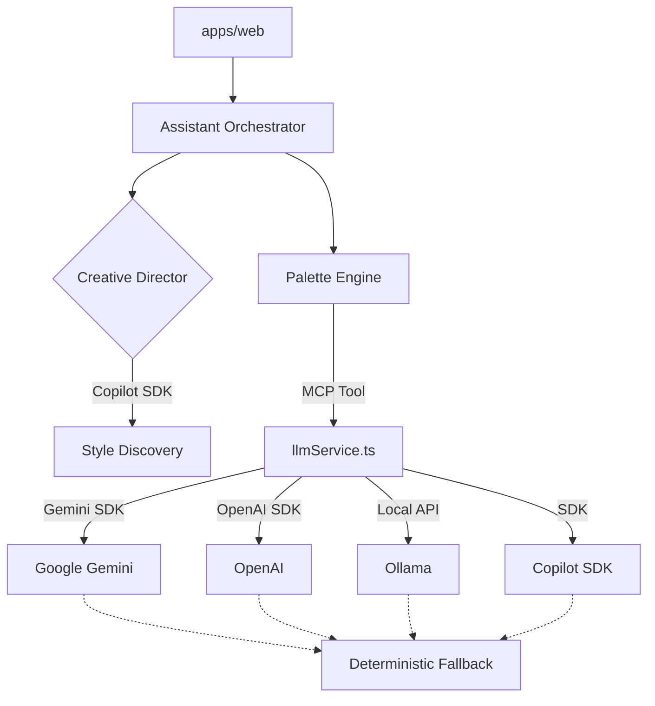

# System Architecture

Theme AI Generator is built as a high-performance, modular system designed for rapid design experimentation. It uses a "Dual-Brain" approach to separate creative reasoning from technical execution.

## Core Flow
The system follows a predictable data flow to ensure resilience and deterministic outputs:
`Frontend (UI) -> Copilot Orchestrator (Creative Director) -> MCP Tools (Palette Engine) -> LLM Providers`

## Module Breakdown

### `apps/web` (Next.js Application)
- **UI Architecture**: Atomic Design implementation (`atoms`, `molecules`, `organisms`, `templates`, `pages`).
- **State Management**: React Context (`ChatContext`) for orchestrating multi-step generation.
- **Mockup Engine**: Dynamic CSS variable injection into realistic product surfaces (Website, Web App, Desktop, Mobile).

### `packages/core` (Shared Logic)
- **llmService.ts**: The engine for palette generation and accessibility enforcement.
- **httpErrors.ts**: Centralized error classification (now including Rate Limit/429 detection).
- **Orchestration**: Logic to handle deterministic fallback across multiple LLM providers.

### `packages/mcp-server` (Protocol Layer)
- **MCP Server**: Implements the Model Context Protocol to expose palette tools to external IDEs (Cursor, Claude Desktop, Antigravity).
- **Transport**: Streamable HTTP transport for session-aware communication.

## Dual-Brain Workflow
1.  **Creative Brain (Copilot SDK)**: Acts as the "Executive Creative Director." It interprets vague user intent and proposes 3 distinct stylistic directions.
2.  **Execution Brain (Engine)**: Acts as the "Production Designer." It takes a chosen mood prompt and generates technically accurate, accessible hex codes using strict JSON contracts.
