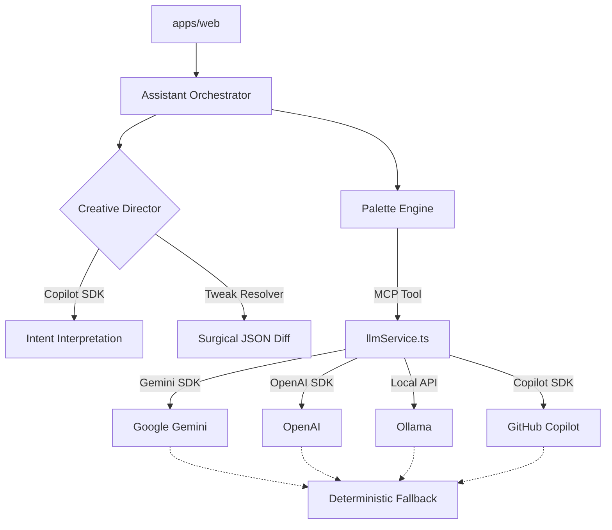

# System Architecture

Theme AI Generator is built as a high-performance, modular system designed for rapid design experimentation. It uses a "Dual-Brain" approach to separate creative reasoning from technical execution, organized within a workspace-based monorepo.

## Core Flow
The system follows a predictable data flow to ensure resilience and deterministic outputs:
`Frontend (UI) -> Assistant Orchestrator (Director) -> MCP Tools (Palette Engine) -> LLM Providers`

## Module Breakdown

### `apps/web` (Next.js Application)
- **UI Architecture**: Atomic Design implementation (`atoms`, `molecules`, `organisms`, `templates`).
- **State Management**: React Context (`ChatContext`) managing provider selection, model defaults, and session persistence (localStorage).
- **Assistant Client**: Handles communication with `/api/assistant/message`.
- **Testing**: Uses `bun test` with `happy-dom` for component unit testing and logic verification.

### `packages/core` (Shared Logic)
- **llmService.ts**: Multi-provider adapter supporting Gemini, OpenAI, Copilot, and Ollama. Handles accessibility math (WCAG contrast ratios) and palette validation.
- **httpErrors.ts**: Centralized error classification and classification (Rate Limit, Auth Failure, etc.).
- **Palette Logic**: Shared types and deterministic fallback generators.

### `packages/mcp-server` (Execution Layer)
- **MCP Server**: A standalone Node.js server implementing the Model Context Protocol.
- **Tools**: Exposes `generate_theme_palette` and `tweak_palette` tools.
- **Architecture**: The web app can either call the MCP server over HTTP or use the exported server logic directly for high-performance internal routing.

## The Dual-Brain System

### 1. The Creative Director (Reasoning)
Located in `assistantOrchestrator.ts`, this layer uses LLMs (primarily Copilot or Gemini) to:
- **Style Discovery**: Propose 3 distinct visual directions based on a product description.
- **Intent Interpretation**: Decide if a user wants to chat, generate a new theme, or tweak an existing one.
- **Surgical Tweak Resolution**: When a user asks for a specific change (e.g., "make primary blue"), the Director generates a **JSON diff** of only the affected keys.

### 2. The Palette Engine (Execution)
The engine is the "Production Designer" that:
- Executes the technical generation of 17-key hex palettes.
- Enforces 60-30-10 color rules.
- Automatically adjusts colors for accessibility (e.g., ensuring `onPrimary` is readable against `primary`).
- Provides deterministic fallbacks if all LLM providers fail.

## Surgical Tweaks
Unlike traditional generators that recreate the entire palette (often losing the user's previous context), Theme AI Generator uses a **diff-based update system**. The Director identifies the specific intent, resolves the target hex codes, and applies a surgical merge to the existing state. This ensures that a request to "change the border color" doesn't accidentally change your primary brand color.
